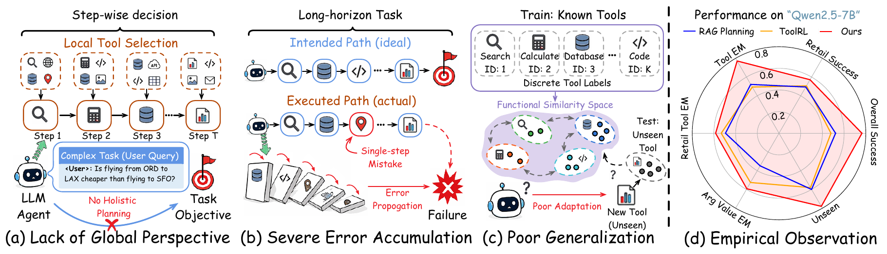
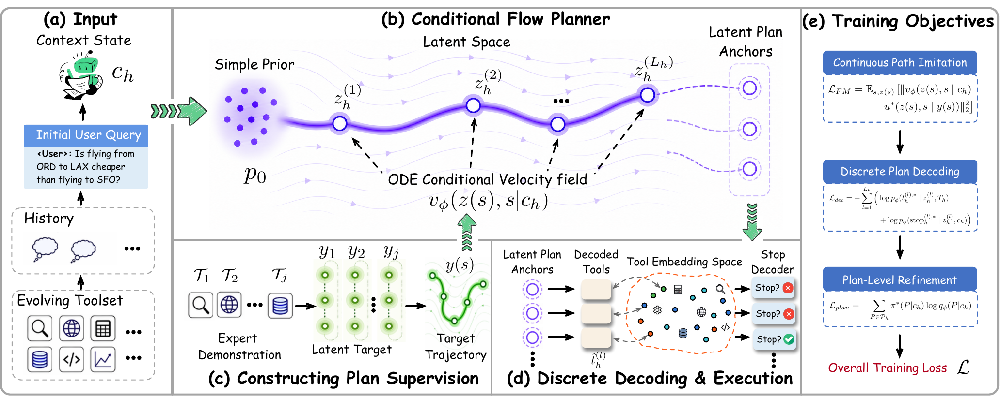

# Tools as Continuous Flow for Evolving Agentic Reasoning

<p align="center">
  <a href="https://github.com/Tairan-Terrian/FlowAgent"></a>
  
  
</p>

<p align="center">
  <a href="#-quick-start">Quick start</a> ·
  <a href="#-what-is-FlowAgent">Overview</a> ·
  <a href="#-reproduce-results">Reproduce</a> ·
  <a href="#-citation">Citation</a>
</p>

> **🎉🎉🎉🎉 Our FlowAgent has been Accepted at NeurIPS 2026. 🎉🎉🎉🎉**

📄 **Paper:** [Tools as Continuous Flow for Evolving Agentic Reasoning](https://arxiv.org/abs/2605.07339)

👥 **Authors:** Tairan Huang, Siyu Shang, Qiang Chen, Xiu Su, Yi Chen.

The paper calls the framework **FlowAgent**; this repository retains the FlowAgent name used by its implementation.

FlowAgent helps an LLM choose the next executable tool call in a long-horizon task. A flow-matching planner proposes a state-conditioned prior, the LLM turns that signal into a strict JSON action, and a grounding layer fills arguments from the current tool state and feedback.

## 🖼️ Method at a glance

<p align="center">
  
</p>

<p align="center"><em>Why step-wise tool selection fails without a global plan.</em></p>

<p align="center">
  
</p>

<p align="center"><em>How planning, execution, grounding, and stopping fit together.</em></p>


## ✨ What is FlowAgent?

- 🧭 **Plan globally:** a continuous flow-matching prior represents useful tool paths.
- 🤖 **Execute locally:** an LLM emits the next tool call or a stop decision as JSON.
- 🔗 **Stay executable:** state and tool-result grounding fills valid arguments.
- 🛡️ **Handle hard decisions:** a conservative selector covers DB-backed retail operations.

## 🚀 Quick start

### 1. Install

```bash
git clone https://github.com:Tairan-Terrian/FlowAgent.git
cd FlowAgent
python -m venv .venv
source .venv/bin/activate          # Windows: .venv\Scripts\Activate.ps1
pip install -r requirements.txt
```

### 2. Inspect the included benchmark

```bash
python - <<'PY'
import json
from pathlib import Path
for name in ["tools.jsonl", "tasks.jsonl", "gold_plans.jsonl"]:
    path = Path("data/benchmark") / name
    print(f"{name}: {sum(1 for _ in path.open())} rows")
PY
```

### 3. Run the lightweight baseline

```bash
python scripts/build_replan_baseline_predictions.py \
  --data-dir data/replan_sft/compact_v4_ci_state_hint \
  --out-dir outputs/predictions/replan_light_baselines_compact_v4
```

The command writes five baseline methods for both development and test splits to `outputs/predictions/replan_light_baselines_compact_v4/`, along with a manifest. It uses the included data and needs no model checkpoint or GPU.

## 📦 What is included?

| Path | Purpose |
|---|---|
| `data/benchmark/` | Tools, tasks, gold plans, and source manifests |
| `data/replan_sft/` | Feedback-conditioned replan data |
| `scripts/` | Training, inference, evaluation, and report entry points |
| `docs/` | Reproducibility notes and baseline details |
| `figures/` | Paper figures in PDF format |

The main data splits contain 1,987 training rows, 121 development rows, and 140 test rows. Expanded `test500` and `test800` evaluation packs are also included.

## 🔬 Reproduce results

These advanced commands require evaluation summaries from your own experiment runs. The clean checkout does not include those summaries or all processed planner artifacts, so it cannot regenerate the full paper reports immediately after installation.

Use the command that matches what you need:

| Goal | Command |
|---|---|
| 📊 Main result table | `bash scripts/reproduce_paper_results.sh main` |
| 🧪 Ablations and compute cost | `python scripts/write_ablation_cost_report.py --root . --out-md results/ABLATION_PARAMETER_COSTS.md --out-json results/ABLATION_PARAMETER_COSTS.json` |
| 📈 Statistical tests | `python scripts/write_significance_report.py --root . --out-md results/SIGNIFICANCE_REPORT.md --out-json results/SIGNIFICANCE_REPORT.json` |
| ⚡ Compute-efficiency curves | `python scripts/write_compute_efficiency_report.py --root . --out-dir data/processed/compute_efficiency` |
| 🔁 Baseline instructions | [`docs/BASELINE_REPRODUCIBILITY.md`](docs/BASELINE_REPRODUCIBILITY.md) |

Most report commands read local evaluation summaries. They do not download model checkpoints automatically.

## 🧰 Train an executor

A minimal LoRA SFT run looks like this:

```bash
torchrun --nproc_per_node 3 scripts/train_fm_prefix_sft.py \
  --no-prefix \
  --data-dir data/replan_sft/compact_v4_ci_state_hint \
  --model-path /path/to/Qwen2.5-7B-Instruct \
  --out-dir outputs/conditioned_sft/flowplanner_lora \
  --epochs 1 --batch-size 2 --grad-accum 4 --max-length 2048
```

For model paths, generation settings, grounding, and evaluation details, see [`docs/BASELINE_REPRODUCIBILITY.md`](docs/BASELINE_REPRODUCIBILITY.md).

## 🗂️ Repository map

```text
FlowAgent/
├── data/          benchmark and replan datasets
├── docs/          reproducibility documentation
├── figures/       motivation and framework PDFs
├── outputs/       local checkpoints and predictions (ignored)
└── scripts/       training, evaluation, and report scripts
```

## 📜 Citation

Please cite the paper using its verified arXiv metadata:

```bibtex
@misc{huang2026toolscontinuousflowevolving,
  title = {Tools as Continuous Flow for Evolving Agentic Reasoning},
  author = {Tairan Huang and Siyu Shang and Qiang Chen and Xiu Su and Yi Chen},
  year = {2026},
  eprint = {2605.07339},
  archivePrefix = {arXiv},
  primaryClass = {cs.AI},
  url = {https://arxiv.org/abs/2605.07339}
}
```
